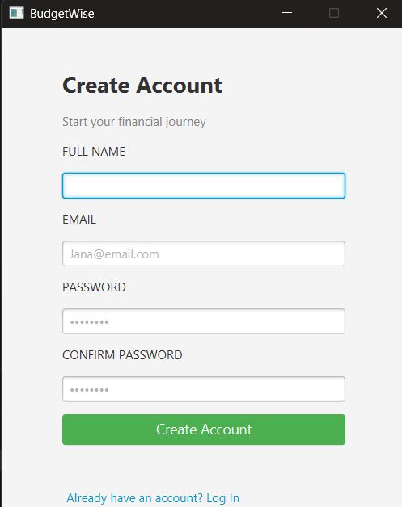
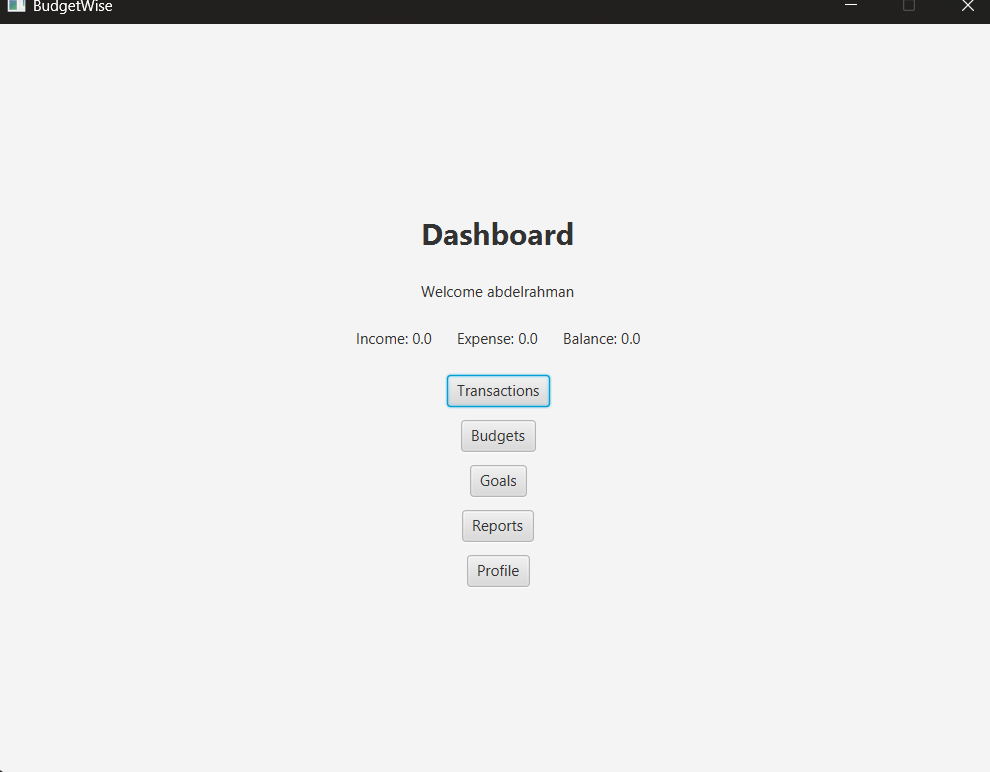
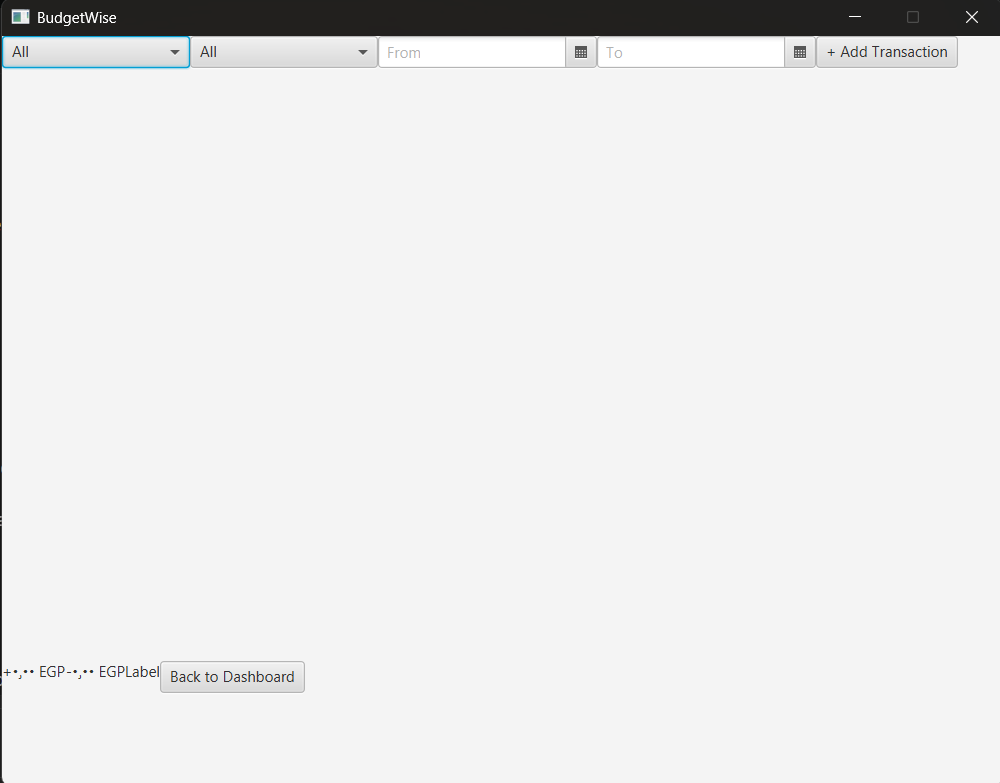

# Features
 
Technology Stack: Java, JavaFX, MySQL

---

# Authentication System

The application provides a complete authentication system that allows users to securely create accounts and log into the system.

## Main Features
- User registration
- Login validation
- Session management
- Input validation
- Password confirmation checking

The system validates:
- Empty fields
- Email format
- Password length
- Matching passwords

This functionality is managed using:
- `LoginController`
- `SignUpController`

---

# Dashboard

The dashboard acts as the main navigation hub of the application.

It displays:
- Total income
- Total expenses
- Current balance
- Navigation buttons for all major modules

Users can quickly navigate to:
- Transactions
- Budgets
- Goals
- Reports
- Profile settings

The dashboard automatically calculates the user's balance using stored transactions.

---

# Transaction Management

The transaction system allows users to manage both income and expenses.

## Features
- Add transactions
- Categorize transactions
- Filter transactions
- Date filtering
- Income and expense tracking

Supported categories include:
- Food
- Transport
- Groceries
- Salary
- Entertainment
- Bills
- Other

The transaction table dynamically updates totals and filtered results.

---

# Budget Management

The budget module allows users to define spending limits for different categories.

## Features
- Add budget limits
- Track spending per category
- Compare spent amount with limits

The system calculates category spending automatically using transaction data.

---

# Goal Management

The goal tracking system helps users monitor their financial goals.

## Features
- Create goals
- Edit goals
- Set target amounts
- Define deadlines
- Track progress

Goals contain:
- Goal name
- Target amount
- Current progress
- Deadline
- Status

---

# Reports and Analytics

The reports module provides visual financial analysis.

## Features
- Generate reports between dates
- Expense distribution pie charts
- Income vs expense bar charts
- Financial insights

The report system helps users better understand spending behavior.

---

# Profile Management

The profile module allows users to customize their settings.

## Features
- Edit profile information
- Change currency
- Change language
- Enable notifications

Supported currencies:
- USD
- EUR
- EGP

Supported languages:
- English
- Arabic