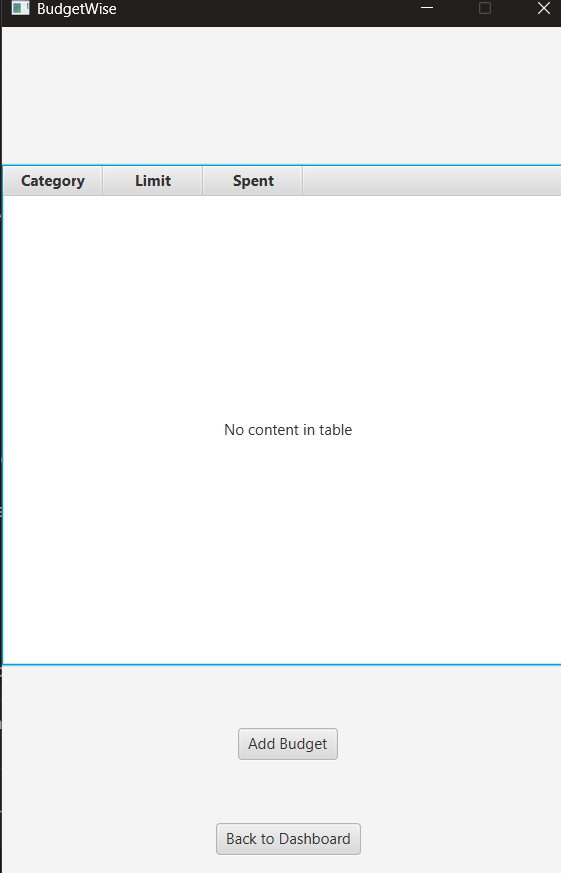
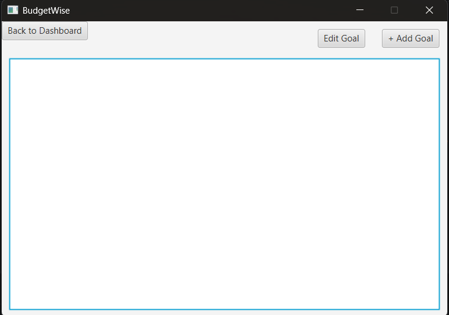
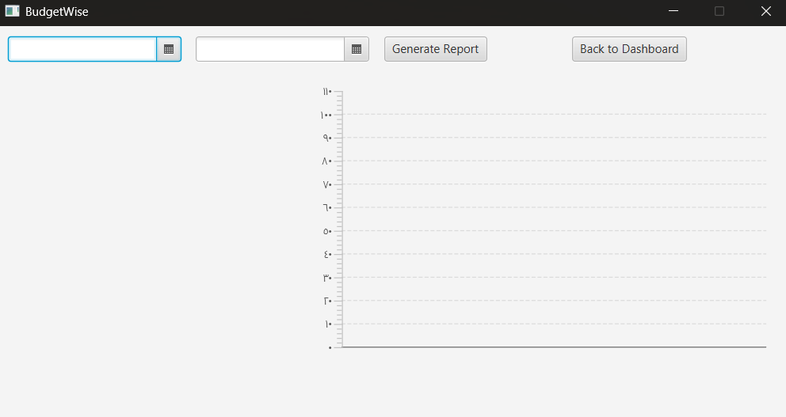
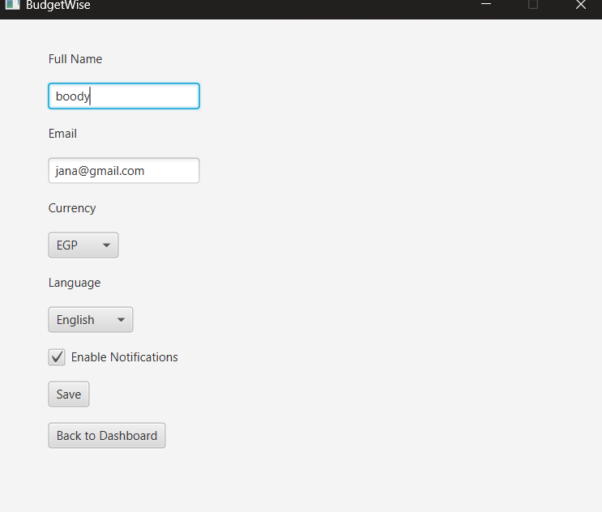

# Application Screenshots

Technology Stack: Java, JavaFX, MySQL

---

# Create Account Screen

The create account screen allows users to register new accounts.

The system validates:
- Empty fields
- Password confirmation
- Email format

---

# Dashboard Screen

The dashboard provides a quick overview of the user's financial data.

Displayed information:
- Total income
- Total expenses
- Current balance
- Navigation shortcuts

---

# Transaction Management Screen

The transaction screen allows users to:
- Add transactions
- Filter records
- Track expenses
- Monitor income

Users can filter by:
- Category
- Type
- Date range

---

# Budget Management Screen

The budget module allows users to monitor category spending and define financial limits.

Features:
- Category budgets
- Spending tracking
- Budget overview

---

# Goal Tracking Screen

The goal tracking system helps users create and manage financial goals.

Features:
- Target amount
- Goal deadlines
- Goal editing
- Progress tracking

---

# Reports Screen

The reports module generates graphical financial analysis.

Visualizations include:
- Pie charts
- Bar charts
- Income vs expense summaries

---

# Profile Screen

The profile screen allows users to customize application settings.

Features:
- Update profile information
- Currency selection
- Language settings
- Notification preferences

