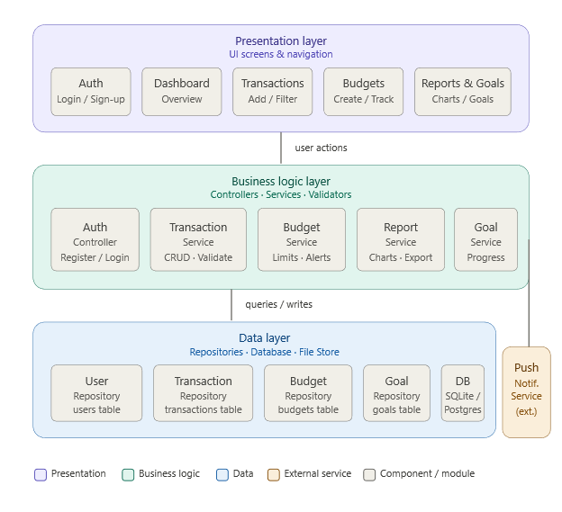
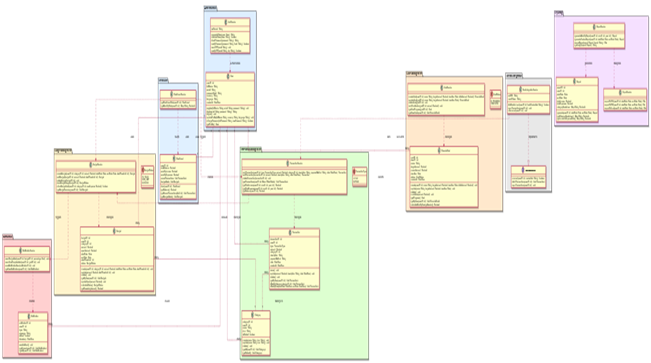
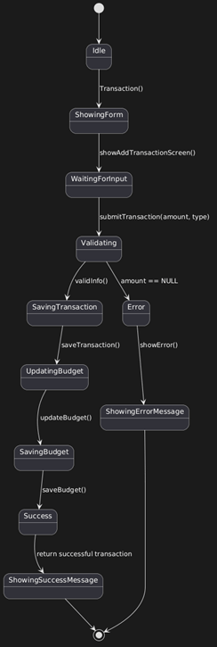

# UML Diagrams

Technology Stack: Java, JavaFX, MySQL

---

# System Architecture

The application follows an object-oriented architecture using the MVC (Model-View-Controller) design pattern.

## Main Components

### Models
The models represent the application's data structure.

Main models include:
- User
- Transaction
- Budget
- Goal
- Report

### Controllers
Controllers handle:
- User interactions
- Navigation
- Data validation
- Business logic

### Views
FXML files are used to create JavaFX graphical interfaces.

---

# Class Diagram

The class diagram illustrates the relationship between the system classes and their responsibilities.

Main relationships include:
- Transactions linked to reports
- Budgets connected to spending calculations
- Goals connected to user progress tracking

---

# State Diagram

The state diagram demonstrates how users interact with the system.

Main states:
- Register
- Login
- Add transaction
- Create budgets
- Manage goals
- Generate reports
- Update profile

---

# Sequence Diagram

The sequence diagram explains the interaction flow between the user interface, controllers, and models.

Main processes:
- Login flow
- Transaction creation
- Report generation
- Goal editing

---

# MVC Design Pattern

The project follows the MVC architecture:

## Model
Handles application data and business objects.

Examples:
- `Transaction`
- `Budget`
- `Goal`
- `User`

## View
FXML screens used to display the graphical interface.

Examples:
- Dashboard screen
- Login screen
- Transaction screen

## Controller
Handles application logic and user interaction.

Examples:
- `DashboardController`
- `TransactionController`
- `ReportsController`

This structure improves:
- Maintainability
- Scalability
- Code organization